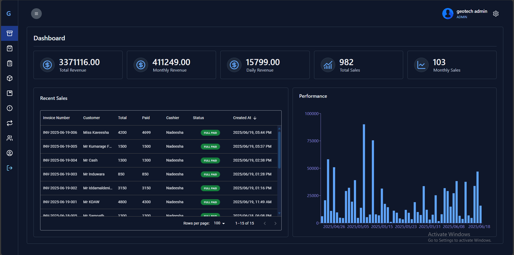

# 💻 Computer Shop POS System (Full-Stack MERN)

A full-featured Point of Sale (POS) system built specifically for a computer shop. This web-based POS application allows for comprehensive inventory management, real-time billing with invoice printing, and detailed transaction tracking.

---

## 🧰 Tech Stack

**Frontend:**
- ⚛️ React.js
- 🔁 Redux Toolkit
- 📦 Axios, React Router DOM
- 💅 Tailwind CSS / MUI & Data-grid (Material UI)
- 📊 Recharts

**Backend:**
- 🟩 Node.js
- 🚀 Express.js
- 🔐 JWT Authentication, bcrypt
- 📂 RESTful API

**Database:**
- 🛢 MongoDB (with Prisma ORM)

---

## 📦 Features

### ✅ Inventory Management
- Add, edit, and delete products
- Track stock levels
- Filter by product categories and brands
- SKU-based tracking
- Multiple price options: cost, retail, and wholesale

### ✅ Billing & Invoicing
- Add products to cart
- Optional discounts
- Generate and print PDF invoices
- Save invoices to the database
- Support for regular and wholesale billing
- Set custom warranties and item-specific pricing
- Add service charges
- Flexible payment options: full, half, or zero payment

### ✅ Sales & Reports
- Complete sales history with filters
- Filter by date, customer, or cashier
- Track outstanding sales
- Cancel or partially/fully return sales
- Monitor outstanding balances for registered members
- Accept installment payments and generate payment bills

### ✅ User Management
- Admin and employee roles
- Secure login/logout with JWT
- Role-based access control
- Register and manage member accounts

### ✅ Store Management *(Multi-store Ready - soon)*
- Super Admin can manage multiple stores
- Each store maintains its own inventory, sales, and staff

---

## 🖼 Screenshots

## 🛠 Setup Instructions

### 1. Clone the repository

git clone https://github.com/SeneshAnujaya/Geotech-POS-Application.git

### 2. Frontend

cd client
npm install & npm run dev

### 2. Backend

cd server
npm install & npm run dev

📝 License
MIT License.
© 2025 Senesh Anujaya

Demo / Deployed Link
🔗 Live URL: https://geotech-pos-app-frontend.vercel.app

